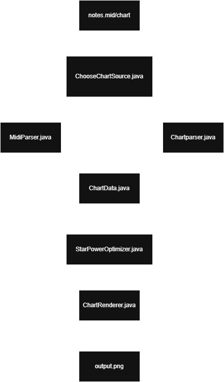

# Introduction/Goals

Our goal for this project is to create an algorithm that finds the
optimal star power path for any chart in the game *Clone Hero* to
achieve a high score. We will create a website that serves as a GUI for this algorithm.

# Background

## What is *Clone Hero*?

*Clone Hero* is a rhythm game based on the popular *Guitar Hero* series.
The gameplay is as follows: notes will appear on what is referred to as
a highway, and you hit the notes by pressing/strumming the corresponding
buttons using a plastic guitar controller.

*Clone Hero* is a community driven game, with people creating charts for
the game, while *Guitar Hero* works like any other game. You buy the
game, and you have a limited number of songs that come with the game.

## How scoring in *Clone Hero* works

In *Clone Hero* there are two types of notes. Standard notes give 50 points when hit. Sustain notes are similar to standard notes,
but holding down the note gives more points per bar held. As you hit
more notes without missing, your score multiplier meter will increase,
with a max of a 4x multiplier.

In the game there is something called star power, which doubles the
score multipler when activated. In order to obtain star power, there are
sections called star power phrases. When you hit all notes in the star
power phrase, the meter will increase by 25%. When the meter hits 50%,
you can then activate star power.

Generally speaking, the best time to activate star power is when there
is a section packed with notes, so that you can maximize the usefulness
of it.

# How the algorithm will function

The algorithm currently works as a command-line pipeline. The
user gives the program an input chart file and an output image
path. The input can be either a .chart file or a .mid file.
First, the parser reads the file and converts it into a shared
internal chart model. This model contains note timing, sustain
lengths, star power phrase ranges, tempo events, time
signatures, and chart resolution.

Next, the optimizer evaluates possible star power activation
decisions across the song and computes the activation path that
gives the highest total score under the implemented game rules.
Finally, the renderer generates a PNG image of the full chart
and highlights the recommended activation points so the result
is easy to follow visually.

# Tools

We are using Java for the majority of this project. We will use
HTML, CSS, and JavaScript to create a website that will serve
as a GUI for input and output

# What is Dynamic Programming?

Dynamic programming (DP) is a method for solving large optimization problems by breaking them into smaller, repeatable subproblems. DP is most useful when two properties are true:

1. **Overlapping subproblems**: the same smaller problem appears many times.
2. **Optimal substructure**: the best answer to the full problem can be built from best answers to smaller problems.

The key idea is to avoid recomputing repeated work. In a recursive search, the same subproblem may be reached through many different decision paths. DP stores the result of each solved subproblem in a cache (memoization), then reuses it instantly when that subproblem appears again.

Conceptually, DP turns:
- "Try every possible future every time"

into:
- "Solve each unique future once, then reuse it"

That is why DP often changes an exponential-time brute-force search into a polynomial-time algorithm.

# How Our Algorithm Uses It

Our optimizer uses **top-down DP with memoization** to maximize score over the full song.

### 1) State definition

Each DP subproblem is represented by:
- `groupIndex`: current note/chord group in time order
- `starPowerMeter`: current SP meter (0 to 200)
- `starPowerActive`: whether SP is currently active

This state contains everything needed to make correct future decisions. If two different decision paths arrive at the same state, their best remaining future score is identical.

### 2) Decision at each state

At each state, the algorithm evaluates up to two actions:
1. **Do not activate SP now**
2. **Activate SP now** (only if SP is inactive and meter is at least the threshold)

For each action, it computes:
- score earned on the current group
- updated meter after phrase gain and drain
- whether SP remains active in the next step

Then it recurses to the next state (`groupIndex + 1`) and adds that future best score.

### 3) Recurrence idea

The recurrence is:

`best(state) = max( score_now(action) + best(next_state_after_action) )`

This is the optimal substructure property in action.

### 4) Base case

When `groupIndex` reaches the end of the song, recursion stops and returns score `0` with no new activations.

### 5) Memoization

Before solving a state, the algorithm checks `memo`:
- if cached, return it immediately
- if not cached, compute it once and store it

This prevents recomputing repeated subproblems.

### 6) Why this is efficient

Without DP, branching decisions can explode toward roughly $2^N$ possibilities for $N$ groups. With memoization, each unique `(groupIndex, meter, active)` state is solved at most once, so runtime is bounded by the number of reachable states, roughly:

`(#groups) × (#meter values) × 2`

That makes optimization practical on full-length songs while still returning globally optimal activation times.

# Pseudocode

```
function findOptimalPath(chartData):
    if no notes:
        return empty activations, score 0
    
    sort notes by time
    groups = buildGroups(notes)
    phraseCompletionTimes = getPhraseCompletionTimes(groups)
    
    mark groups that complete phrases
    
    memo = empty map
    result = dpSolve(groups, state(index=0, meter=0, active=false), memo)
    
    sort result.activations chronologically
    return result


function dpSolve(groups, state, memo):
    if state.groupIndex >= groups.size():
        return (score=0, activations=[])
    
    if state in memo:
        return memo[state]
    
    group = groups[state.index]
    
    meterAfterGain = min(MAX_METER, state.meter + (PHRASE_GAIN if group.completes_phrase else 0))
    basePoints = 50 * group.noteCount + group.sustainPoints
    
    bestScore = -infinity
    bestActivations = []
    
    // Option 1: do not activate SP
    effectiveMult = group.baseMultiplier * (2 if state.active else 1)
    scoreThisGroup = basePoints * effectiveMult
    meterAfterDrain = applyDrain(meterAfterGain, state.active, group)
    boolean nextActive = state.active and meterAfterDrain > 0
    sub = dpSolve(groups, state(index+1, meterAfterDrain, nextActive), memo)
    total = scoreThisGroup + sub.score
    if total > bestScore:
        bestScore = total
        bestActivations = sub.activations
    
    // Option 2: activate SP (if possible)
    if not state.active and meterAfterGain >= ACTIVATION_THRESHOLD:
        effectiveMult = group.baseMultiplier * 2
        scoreThisGroup = basePoints * effectiveMult
        meterAfterDrain = applyDrain(meterAfterGain, true, group)
        nextActive = meterAfterDrain > 0
        sub = dpSolve(groups, state(index+1, meterAfterDrain, nextActive), memo)
        total = scoreThisGroup + sub.score
        if total > bestScore:
            bestScore = total
            bestActivations = [group.time] + sub.activations
    
    memo[state] = (bestScore, bestActivations)
    return (bestScore, bestActivations)
```
## How it Works

1. The parser reads a .chart or .mid file and converts it into a shared chart model.
2. Notes are grouped by timestamp, and Star Power phrase completion points are marked.
3. The optimizer runs dynamic programming to test activation choices at each group:
    activate now (if meter is high enough) or save meter for later.
4. For each state, the best future result is cached and reused, which avoids recalculating the same subproblems.
5. The best activation timestamps are returned, then rendered on a chart image for easy use.


# TimeLine

Tweak algorithm to be more accurate and include star power gained from sustains

Make a GUI for project

Add a feature that notifies player when to activate star power in real time

# Diagram




